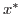
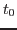
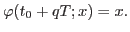

<h4>Computation of periodic orbits for non-autonomous systems</h4>

These routines compute the initial conditions for a periodic orbit of a non-autonomous with periodic dependence on time:

<!-- MATH
 \begin{equation*}
\dot{x}=f(x,t),\quad f(x,t+T)=f(x,t).
\end{equation*}
 -->
<TABLE CLASS="equation*" CELLPADDING="0" WIDTH="100%" ALIGN="CENTER">
<TR VALIGN="MIDDLE">
<TD NOWRAP ALIGN="CENTER"></TD>
<TD NOWRAP CLASS="eqno" WIDTH="10" ALIGN="RIGHT">
&nbsp;&nbsp;&nbsp;</TD></TR>
</TABLE>

 

That is, the goal is to compute a point  such  that, for a given
,

<!-- MATH
 \begin{equation*}
\varphi(t_0+qT;x)=x.
\end{equation*}
 -->
<TABLE CLASS="equation*" CELLPADDING="0" WIDTH="100%" ALIGN="CENTER">
<TR VALIGN="MIDDLE">
<TD NOWRAP ALIGN="CENTER"></TD>
<TD NOWRAP CLASS="eqno" WIDTH="10" ALIGN="RIGHT">
&nbsp;&nbsp;&nbsp;</TD></TR>
</TABLE>

 

The method used consists on performing a Newton method to solve the equation

<!-- MATH
 \begin{equation*}
S_{t_0}(x)-x=0,
\end{equation*}
 -->
<TABLE CLASS="equation*" CELLPADDING="0" WIDTH="100%" ALIGN="CENTER">
<TR VALIGN="MIDDLE">
<TD NOWRAP ALIGN="CENTER"></TD>
<TD NOWRAP CLASS="eqno" WIDTH="10" ALIGN="RIGHT">
&nbsp;&nbsp;&nbsp;</TD></TR>
</TABLE>

 

where  is the stroboscopic map (time  return map):

<!-- MATH
 \begin{equation*}
S_{t_0}(x)=\varphi(t_0+qT;x)
\end{equation*}
 -->
<TABLE CLASS="equation*" CELLPADDING="0" WIDTH="100%" ALIGN="CENTER">
<TR VALIGN="MIDDLE">
<TD NOWRAP ALIGN="CENTER"></TD>
<TD NOWRAP CLASS="eqno" WIDTH="10" ALIGN="RIGHT">
&nbsp;&nbsp;&nbsp;</TD></TR>
</TABLE>

 

The program needs the gsl libraries, and can be compiled using

g++ -o main main.c rk78.c lu.c memory.c -lgsl -lgslcblas

