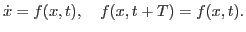

Computation of periodic orbits for non-autonomous systems

These routines compute the initial conditions for a periodic orbit of a non-autonomous of type

<!-- MATH
 \begin{equation*}
\dot{x}=f(x,t),\quad f(x,t+T)=f(x,t)
\end{equation*}
 -->
<TABLE CLASS="equation*" CELLPADDING="0" WIDTH="100%" ALIGN="CENTER">
<TR VALIGN="MIDDLE">
<TD NOWRAP ALIGN="CENTER"></TD>
<TD NOWRAP CLASS="eqno" WIDTH="10" ALIGN="RIGHT">
&nbsp;&nbsp;&nbsp;</TD></TR>
</TABLE>

$\dot{x}=f(x,t)$
system periodically depending on
